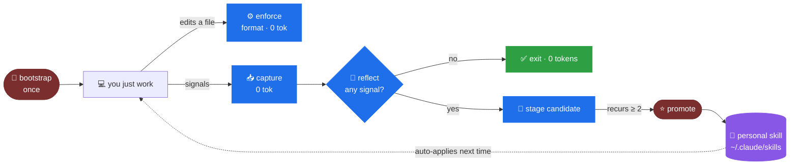

<div align="center">

# 🔁 skill-loop

### Self-improving coding skills for Claude Code

**Learn a codebase once — then get a little better on every session, automatically.**
Personal to you, never pushed to a repo, and free on the sessions where nothing happens.


```bash
/plugin marketplace add joeljohn159/skill-loop
/plugin install skill-loop@skill-loop
/skill-loop:bootstrap
```

</div>

> [!TIP]
> The first run reads your codebase and generates exactly the skills Claude needs so it won't break your conventions on the next PR. After that it improves them on its own — and stays at **zero tokens** on sessions where nothing notable happens.

---

## ✨ What it does

- 🧠 **Learns your conventions** — naming, layering, testing, error-handling, domain patterns.
- ✂️ **Hard split** — anything a linter/formatter can enforce becomes config; only *judgment* rules become skills.
- 🪶 **Stays cheap** — one gated model call per session, skipped entirely when there's no signal.
- 👤 **Personal** — your learned skills live in *your* home dir and apply across all your projects. Teammates are never affected; nothing is committed or pushed.
- ⏪ **Always reversible** — skills are plain files you can read, edit, or delete; promotion keeps a backup.

## 🚀 Quickstart

| Step | Command | |
|------|---------|---|
| 1 | `/plugin marketplace add joeljohn159/skill-loop` | add the marketplace |
| 2 | `/plugin install skill-loop@skill-loop` | install the plugin |
| 3 | `/skill-loop:bootstrap` | once — seed your skills + pick your models |
| 4 | *(just work)* | it captures, reflects & applies skills automatically |
| 5 | `/skill-loop:promote` | occasionally — lock in the rules that recur |

## 🔄 The loop



## 🧭 The six layers

| # | Layer | Trigger | Cost | What it does |
|---|-------|---------|------|--------------|
| 1 | 🚀 **Bootstrap** | `/skill-loop:bootstrap` | Opus, once | Crawl the repo. Judgment rules → tiny skills. Linter-enforceable rules → formatter config. Every rule ships with a verify command. |
| 2 | ⚙️ **Enforce** | PostToolUse | 🟢 **0 tokens** | Auto-run the project formatter on each edited file. Deterministic rules never become skills. |
| 3 | 📥 **Capture** | hooks | 🟢 **0 tokens** | Append raw signals: `CORRECTION` · `NEW_PATTERN` · `APPROVAL` · `FAILURE`. |
| 4 | 🧠 **Reflect** | Stop hook | 🟡 gated (~0 most sessions) | No signal → exit free. Else **one model pass** over only the flagged diffs → de-duped candidate rules with a recurrence count. |
| 5 | ⭐ **Promote** | `/skill-loop:promote` | Sonnet, rare | Recurring candidates → generalized → written into your personal skills (manual, never automatic). |
| 6 | 🔧 **CI feedback** | `/skill-loop:learn-from-ci` | model_ci | Paste a failing build log from **any** CI; it + your local fix become a high-value candidate. Runs locally. |

## 🧠 What it learns from

| Signal | Meaning |
|--------|---------|
| 🟦 **CORRECTION** | You edit a file Claude wrote (detected by hashing; a real before/after diff is kept). |
| 🟪 **NEW_PATTERN** | You introduce a library/tool Claude didn't use. |
| 🟩 **APPROVAL** | A task lands cleanly — a commit/merge/push with no errors. |
| 🟥 **FAILURE** | A command, test, or build errors (including CI). |

## 🎛️ Commands

| Command | When | What |
|---------|------|------|
| `/skill-loop:bootstrap` | once per repo | Crawl → seed personal skills + formatter config. Asks your model profile on first run. |
| `/skill-loop:logs` | anytime | Open a live, colorized activity log in a new terminal tab. |
| `/skill-loop:learn [lesson]` | anytime | Learn now from the current chat; optionally capture a lesson you state. |
| `/skill-loop:learn-from-ci` | on a red build | Paste a failing CI log → stage a fix rule. Any CI, runs locally. |
| `/skill-loop:promote` | when candidates pile up | Turn recurring candidates into skills (**manual — never automatic**). |
| `/skill-loop:configure` | anytime | Choose models per stage: Maximum / Balanced / Economy / Custom. |

## 👤 Personal by design

> [!IMPORTANT]
> Everything skill-loop learns is **yours** and **never touches a repo**.
> - **Skills** → `~/.claude/skills/sl-*` — apply across *all* your projects.
> - **Learning state** → `~/.skill-loop/` — signals, candidates, logs, config.
>
> Teammates are unaffected; nothing is committed or pushed. The one thing `bootstrap` may add to a repo is a standard formatter config (e.g. `.prettierrc`) — shared team infra, **not** a skill.

## 💸 Token discipline

- The Stop reflection is the **only** automatic per-session model call — and it's skipped entirely when the deterministic pre-scan finds no signal.
- Strict tiering: **Haiku** for capture/extraction; **Sonnet/Opus** only for bootstrap & promote (all configurable).
- Skills stay tiny via progressive disclosure — the `description` loads, the body loads on match. Session start injects only a compact index.
- De-dup + a recurrence threshold gate every write, so skill files never bloat.

## 🎚️ Choosing your models

Run `/skill-loop:configure` (bootstrap also asks on first run). `reflect` is the only automatic call, so its model is the main cost lever — set everything to Opus if you don't worry about tokens.

| Profile | bootstrap | promote | reflect | ci |
|---------|-----------|---------|---------|----|
| 🟣 **Maximum** — quality first | opus | opus | opus | opus |
| 🟢 **Balanced** — default | opus | sonnet | haiku | haiku |
| 🔵 **Economy** — cheapest | sonnet | haiku | haiku | haiku |
| ⚪ **Custom** | pick each stage | | | |

## 🛡️ Safety

- ✅ **Never auto-promotes** — reflection only *stages* candidates; skills change only when you run `/skill-loop:promote`.
- ↩️ **Revertable** — promotion backs up the prior skill to `~/.skill-loop/skill-history/`; undo = restore or delete the file.
- 🔒 **Never blocks you** — every hook exits cleanly and degrades gracefully if `jq` / `claude` / a formatter is missing.
- 🧯 **Off switches** — `claude plugin disable skill-loop`, or `reflect=off` / `capture=off` / `enforce=off` in `~/.skill-loop/config`, or delete any `sl-*` skill.

## 📂 Layout

```text
.claude-plugin/   plugin.json · marketplace.json
commands/         bootstrap · promote · learn-from-ci · learn · configure · logs
skills/           skill-loop-help            # ships with the plugin
hooks/            hooks.json                 # SessionStart · PostToolUse · Stop
bin/              enforce · capture · reflect · session-index · watch · open-logs · event
lib/              common.sh
```

All internal paths resolve through `${CLAUDE_PLUGIN_ROOT}` / `${HOME}` — nothing hardcoded.

---

<div align="center">
<sub>Built for Claude Code · MIT · a styled HTML version lives in <code>readme.html</code></sub>
</div>
