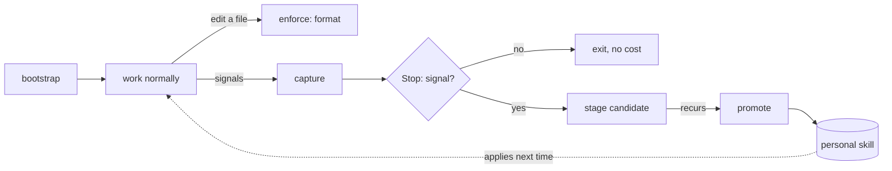

# skill-loop

A Claude Code plugin that learns a codebase's conventions and applies them on
later sessions. It generates a small set of coding skills from an existing
repository, then keeps them current as you work, learning from corrections, new
patterns, clean merges, and failures.

Learned skills are personal to you and scoped per project. Nothing is committed
to or pushed into your repositories, and most sessions cost no additional tokens.


## Installation

```bash
/plugin marketplace add joeljohn159/skill-loop
/plugin install skill-loop@skill-loop
```

Then run once per repository:

```bash
/skill-loop:bootstrap
```

Bootstrap reads the codebase and writes a small set of convention skills. After
that the plugin works in the background. You interact with it only to promote
recurring lessons, and occasionally to change models or view its log.

## How it works

The plugin is organized as six layers. The expensive, high-capability work is
rare and explicit. The recurring per-session work is cheap, and is skipped
entirely when there is nothing to learn.

| Layer | Trigger | Cost | Responsibility |
|-------|---------|------|----------------|
| Bootstrap | `/skill-loop:bootstrap` | Opus, once | Read the repo. Judgment rules become skills; mechanically enforceable rules become formatter and linter configuration. Each rule ships with a command that verifies it. |
| Enforce | PostToolUse hook | none | Run the project formatter on each edited file. Deterministic rules are fixed automatically and never become skills. |
| Capture | hooks | none | Record raw signals: corrections, new patterns, approvals, failures. |
| Reflect | Stop hook | gated | A deterministic pre-scan runs first; with no signal it exits at no cost. Otherwise one model pass extracts and de-duplicates candidate rules. |
| Promote | `/skill-loop:promote` | Sonnet, rare | Generalize recurring candidates, write them into your skills, and prune stale entries. Manual, never automatic. |
| CI feedback | `/skill-loop:learn-from-ci` | model_ci | Turn a failing build and the fix that resolved it into a candidate rule, processed locally. |



Reflection is the only automatic per-session model call, and it is gated: a
correction, a new dependency, a failed test, or a clean merge will trigger it,
while an uneventful session triggers nothing.

## Commands

| Command | Purpose |
|---------|---------|
| `/skill-loop:bootstrap` | Read the repo and generate its convention skills. Run once per project; prompts for your model profile on first use. |
| `/skill-loop:promote` | Move recurring candidates into your skills. Manual, never automatic. |
| `/skill-loop:learn` | Reflect on the current session immediately, instead of waiting for it to end. Accepts an optional lesson to record. |
| `/skill-loop:learn-from-ci` | Paste a failing CI log and let the fix become a candidate rule. Works with any CI; runs locally. |
| `/skill-loop:configure` | Choose which model each stage uses. |
| `/skill-loop:logs` | Open a readable activity log in a separate terminal tab. |

## Models

Each stage's model is configurable through `/skill-loop:configure` (bootstrap
also prompts on first run). Reflection is the only automatic call, so its model
is the main cost lever.

| Profile | bootstrap | promote | reflect | ci |
|---------|-----------|---------|---------|-----|
| Maximum | opus | opus | opus | opus |
| Balanced (default) | opus | sonnet | haiku | haiku |
| Economy | sonnet | haiku | haiku | haiku |
| Custom | chosen per stage | | | |

## Storage and privacy

Everything skill-loop learns is personal, per-project, and kept in your home
directory. Nothing is written into a repository.

- Skill: `~/.claude/skills/sl-<project>/SKILL.md` — one folder per project, with a
  section per concern, scoped with a `paths:` rule so it activates only inside that
  project.
- Per-project state: `~/.skill-loop/projects/<project>/` (signals, candidates,
  snapshots, activity log).
- Global preferences: `~/.skill-loop/config` (model choices, thresholds, scope).

Projects stay isolated, so one repository's rules never apply in another. To
share a single set across all projects, set `scope=global` in the config. The
only file bootstrap may add to a repository is a standard formatter config such
as `.prettierrc`, which is shared team infrastructure rather than a skill.

## Safety

- Promotion is always manual. Reflection only stages candidates; skills change
  when you run `/skill-loop:promote`.
- Each promotion backs up the previous version of the skill, so any change can
  be reverted.
- Hooks never block a session. They exit cleanly and degrade gracefully when an
  optional tool (`jq`, `claude`, a formatter) is unavailable.
- To turn it off: `claude plugin disable skill-loop`, or set `reflect=off`,
  `capture=off`, or `enforce=off` in the config, or delete any generated skill.

## Layout

```
.claude-plugin/   plugin.json, marketplace.json
commands/         bootstrap, promote, learn, learn-from-ci, configure, logs
hooks/            hooks.json
bin/              enforce, capture, reflect, session-index, watch, open-logs, event, sl-where
lib/              common.sh
```

Internal paths resolve through `${CLAUDE_PLUGIN_ROOT}` and `${HOME}`.

## License

MIT. A styled HTML version of this document is available in `readme.html`.
